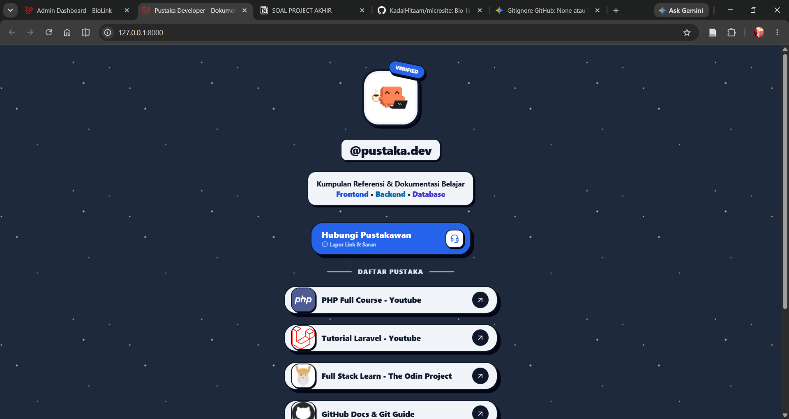

- **Nama Lengkap**: Naufal Alexander
- **NIM**: 2430511010
- **Kelompok**: Kelompok 1

# 🔗 Bio-Link Microsite & Link Tracker

A fast, lightweight developer bio-link page with custom link redirect tracking and click counters built with Laravel.



## ✨ Key Features

- 🚀 **Bio-Link Showcase**: Halaman profil publik untuk menampilkan semua tautan proyek dan media sosial.
- 📊 **Click Analytics & Tracking**: Pencatatan statistik jumlah klik dan sistem *redirect tracking* otomatis.
- 🎨 **Responsive UI**: Tampilan optimal di perangkat *mobile* maupun *desktop* dengan Tailwind CSS.
- 🛡️ **Admin Management**: Dashboard untuk menambah, mengedit, atau menghapus tautan dengan mudah.

## 🛠️ Tech Stack

- **Backend:** Laravel 11
- **Database:** MySQL
- **Frontend / Styling:** Tailwind CSS
- **Local Dev Environment:** Laragon / PHP 8.x

## 🚀 Quick Start

### Prerequisites

- PHP >= 8.2
- Composer
- MySQL Database

### Installation Steps

1. **Clone repository**
   ```bash
   git clone https://github.com/KadalHitaam/microsite.git
   cd biolink-microsite

    Install dependencies:
    composer install
    npm install && npm run build

    Setup environment:
    cp .env.example .env
    php artisan key:generate
    Sesuaikan konfigurasi DB_DATABASE, DB_USERNAME, dan DB_PASSWORD di file .env.

    Migrasi database
    php artisan migrate --seed

    Jalankan server lokal:
    php artisan serve

Akses aplikasi di http://127.0.0.1:8000